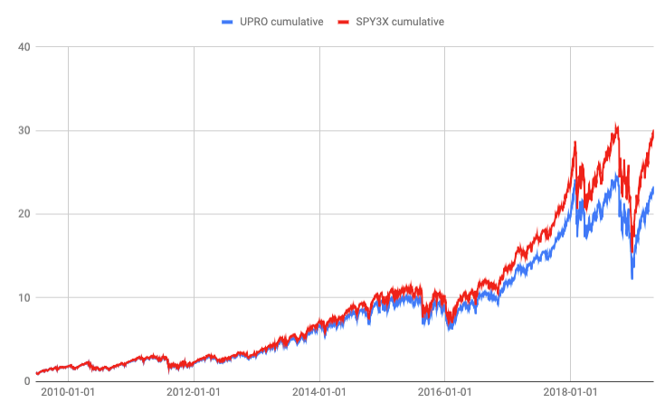
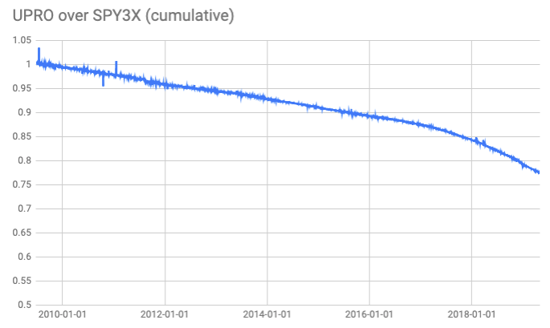
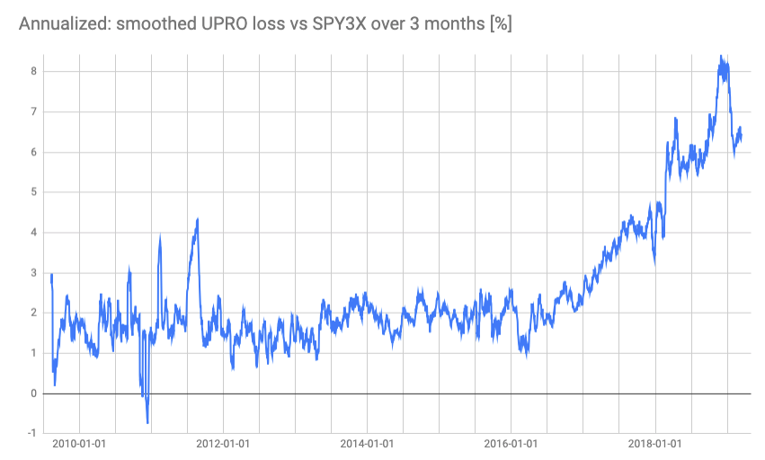

# UPRO
`UPRO` is a leveraged ETF that promises 3x daily returns
of `S&P 500`. Details: http://etf.com/UPRO, 
[fund's prospectus](https://www.proshares.com/funds/prospectus.html?ticker=UPRO).

### Non-purpose of this repository
Be of any financial advice. Don't buy `UPRO` if you cannot stomach
100% losses.  It can literally go to zero in a single day - from
the fund's prospectus:

```
> For example, because the Fund includes a multiplier of three times
> (3x) the Index, a single day movement in the Index approaching 33%
> at any point in the day could result in the total loss of an
> investor’s investment if that movement is contrary to the investment
> objective of the Fund, even if the Index subsequently moves in
> an opposite direction, eliminating all or a portion of the earlier
> movement. 
```

### Purpose of this repository
See what has really happened to `UPRO` between June 2009
and April 2019 - how well it has been tracking it's target,
what's the deviation from the target and how can one predict
future deviation.

### UPRO's stated target
From the fund's prospectus:
```
> ProShares UltraPro S&P500 (the “Fund”) seeks daily investment
> results, before fees and expenses, that correspond to three times
> (3x) the return of the S&P 500® Index (the “Index”) for a single
> day, not for any other period. A “single day” is measured from the
> time the Fund calculates its net asset value (“NAV”) to the time of
> the Fund’s next NAV calculation.
```

As I understand the NAV is calculated after every trading day. To assess
the performance of `UPRO` I'll compare it to compounded 3x daily `SPY`
price changes, from previous closing price to next closing price.

Let's call this "ideal" 3x daily `SPY` fund as `SPY3X`. On every market
closing the `SPY3X` has exactly 3x the percentage change of `SPY`. For
example, suppose that on day 1 `SPY` closes at 100.00, and `SPY3X`
closes at 200.00; on day 2 `SPY` closes at 102.50 (which means it had
a 2.5% daily change). Given all of that `SPY3X` must have closed at
215.00 (which means it had a 7.5% daily change).

### Handling of dividends
Dividends of a day need to be added to the closing price of `SPY` when
constructing `SPY3X`. Otherwise the comparison is unfair, it makes it
look like `UPRO` delivers higher results than `SPY3X`, which is
a cost-free and an interest-rate-free version of `UPRO`.


It becomes more clear when we divide `UPRO` price by `SPY3X` price
(again, without dividends, which is what causes the "sawtooth"):


### Divergence between UPRO and SPY3X
Both funds have very similar performance, although over the analyzed period
`UPRO` delivered only slightly below 80% of the returns of
the (virtual) `SPY3X`:





To better understand the `UPRO`/`SPY3X` plot I've done two things:
  - I've replaced every point in the above graph by a 2-weeks moving
    average (± 1 week around the point)
  - I've computed the holding cost (as a multiplicative change in
    the `UPRO`/`SPY3X` value) from 6 weeks before each day till
    6 weeks after each day and annualized it. In other words, for
    any given day, what was the annualized `UPRO` loss vs `SPY3X`,
    as a percentage?
This is the result:


